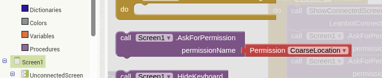
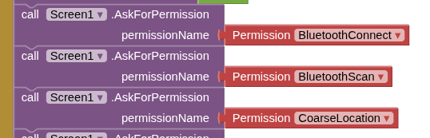
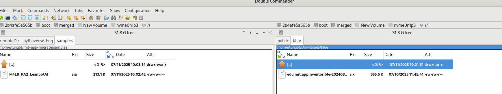
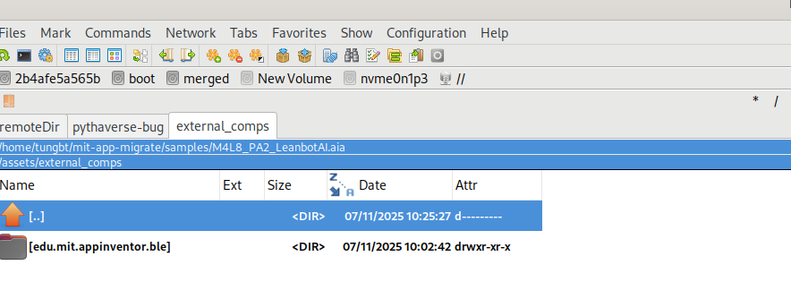
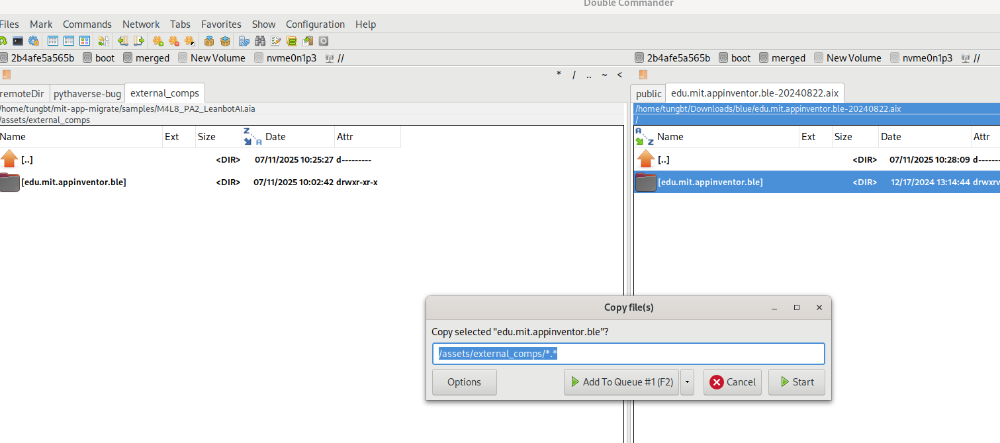
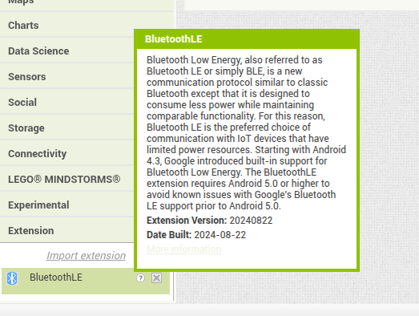

# MIGRATE PYTHAVERSE APP INVENTOR 
## Rules:
### Scope: 
* All application created before Jul/10/2025 which use `AskForPermission` block.
* All application use `bluetooth` component

All app permission used in app need to be upgrade to new version. if you dont, you will see error 908 on the screen, which is wrong permitsion.

Old style: using text to grant permission to app

New Style: use dropdown box to selection permission

How to migrate: remove old blockly grant permission, then click to `Screen` sidebar and select block `AskForPermission` and fill in permission 

### NOTE: 
* Grant permission for bluetooth: the new version improvement comparative with more devices but there is a small changed.
To grant bluetooth permission to device you must grant 3 permitssion as bellow:

## Migrate application use bluetooth component
These are two method to upgrade old application to new version
### Method 1: 

Replace old bluetooth module directly from ui design in pythaverse app maker web.

Steps to replace:
* Open application in app inventor
* Download new bloetooth extension from mit app inventor [bluetooth extension](https://iot.appinventor.mit.edu/assets/resources/edu.mit.appinventor.ble-20240822.aix)
* Click on `Extension` on the bottom left of sidebar to expand `Extension`
* Click `Import extension` link and choose newer bluetooth extension to replace old version to new one.
* Open blockly editor and modify code follow as `Rules` describe above. 

Note: with this method, you must rewrite from scratch every blockly blocks relate to bluetooth module. 

### Method 2:

Replace old bluetooth module by direct modify .aia file.

Tooth require:
* double commander: download from here:
  * window user: https://sourceforge.net/projects/doublecmd/files/DC%20for%20Windows%2064%20bit/Double%20Commander%201.1.26/doublecmd-1.1.26.x86_64-win64.exe/download
  * linux user: https://download.opensuse.org/repositories/home:/Alexx2000/AppImage/doublecmd-gtk-latest-x86_64.AppImage

Steps to replace:
* Create a directory and copy .aia into that folder: eg: c:\migrate\M4L8_PA2_LeanbotAI.aia
* Download new bloetooth extension from mit app inventor [bluetooth extension](https://iot.appinventor.mit.edu/assets/resources/edu.mit.appinventor.ble-20240822.aix) and save it to another folder: eg: c:\blue
* Open double commander, on the left panel open directory contain your app, on the right panel open directory contain bluetooth extension

* Highlight the app in the left and press `Ctrl+PgDn` to jump into .aia file, move cursor to `assets` then press `Enter`,
move cursor to `external_comps` then press `Enter`. Now you see the `edu.mit.appinventor.ble` on the screen.

* Now switch to the right panel of double commander, highlight the file `edu.mit.appinventor.ble-20240822.aix` and press `Ctrl+PgDn`, highlight the directory `edu.mit.appinventor.ble` on the right panel and press `F5` key to copy newer bluetooth module to override old bluetooth module. Click `start` when dialog copies appeared. when double commander asked for override old files, choose `Overwrite All` button. 

* Open the Pythaverse app inventor to import your new upgrade project. Move mouse cursor over `question` mark of the bluetooth module and then click it, check to see your bluetooth `Extension Version: 20240822`, switch to `blocks` to upgrade your code as `Rules` above.

Note: This method upgrade the bluetooth module without lost any `code block` in your app, just apply `Rules` above to migrate.

## Example working application use bluetooth 
* [M4L8_PA2_LeanbotAI.aia](samples/M4L8_PA2_LeanbotAI.aia)
